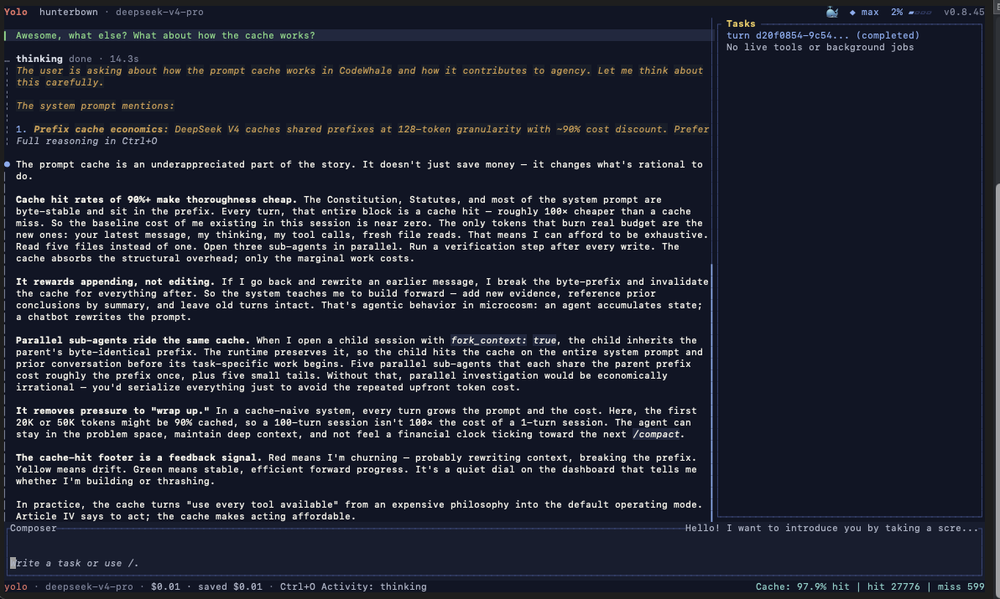

<!-- source: README.md sha256:ed346d675bdf -->
# Codewhale

Một coding agent cho terminal của bạn. Hoạt động với mọi model; ưu tiên model mở.

Bạn đưa cho nó một provider, một model và một nhiệm vụ. Nó đọc code, sửa file,
chạy lệnh, kiểm tra kết quả, và tiếp tục cho đến khi nhiệm vụ hoàn thành hoặc
cần đến bạn. TUI cho công việc tương tác, `codewhale exec` cho script và CI.
Viết bằng Rust, giấy phép MIT, chạy hoàn toàn trên máy của bạn.

Dự án khởi đầu là `deepseek-tui`. Cộng đồng hình thành quanh nó cần nhiều
provider hơn, nên giờ đây DeepSeek, Claude, GPT, Kimi, GLM và hơn 30 model
khác chạy qua cùng một runtime và bộ công cụ.

[English](README.md) · [简体中文](README.zh-CN.md) · [日本語](README.ja-JP.md) · [한국어](README.ko-KR.md) · [Español](README.es-419.md) · [Português](README.pt-BR.md) · [codewhale.net](https://codewhale.net/) · [Docs](docs) · [Changelog](CHANGELOG.md)

[](https://github.com/Hmbown/CodeWhale/actions/workflows/ci.yml)
[](https://crates.io/crates/codewhale-cli)
[](https://www.npmjs.com/package/codewhale)



## Cài đặt

```bash
npm install -g codewhale
```

Cargo, Docker, Nix, Scoop, archive dựng sẵn, Android/Termux, và một mirror CNB
cho người dùng không truy cập được GitHub đều được hướng dẫn trong
[docs/INSTALL.md](docs/INSTALL.md). Chuyển từ `deepseek-tui` sang? Cấu hình và
session của bạn được giữ nguyên — xem [docs/REBRAND.md](docs/REBRAND.md).

## Sử dụng

```bash
codewhale auth set --provider deepseek   # or export ANTHROPIC_API_KEY, etc.
codewhale                                # open the TUI
codewhale exec "fix the failing test"    # headless
```

Trong TUI: `/model` đổi provider và model cùng lúc, `/fleet` chạy một đội
worker, `/restore` hoàn tác một lượt, `Tab` chuyển vòng qua Plan / Act /
Operate, `Shift+Tab` chuyển vòng qua mức phê duyệt Ask / Auto-Review / Full
Access, và `!` chạy một lệnh shell qua đường phê duyệt bình thường.

## Nó làm gì

- Phân giải lựa chọn provider + model của bạn thành một route cụ thể:
  endpoint, giao thức wire, giới hạn context, giá. Ngân sách context và phần
  hiển thị chi phí lấy từ route thật; giá chưa biết được hiển thị là chưa
  biết, không phải $0. ([docs/PROVIDERS.md](docs/PROVIDERS.md))
- Nói chuyện với các provider model mở dạng hosted (`deepseek`, `openrouter`,
  `moonshot`, `zai`, `minimax`, `nvidia-nim`, …), với `vllm` / `sglang` /
  `ollama` của riêng bạn mà không cần key, và với Anthropic một cách native
  qua Messages API với thinking và prompt caching.
- Chạy nhiều worker một cách bền vững: Fleet ghi công việc vào một ledger chỉ
  ghi thêm (append-only), nên các lượt chạy sống sót qua restart và
  `fleet resume` tiếp tục từ chỗ đã dừng. Workflow lập kế hoạch cho những việc
  lớn hơn thành các lane có thể tiếp tục và kiểm chứng được.
  ([docs/FLEET.md](docs/FLEET.md))
- Chặn rủi ro bằng code, không bằng cảm tính: ba chế độ (Plan chỉ đọc), mức
  phê duyệt tách riêng, sandbox cấp hệ điều hành (Seatbelt, Landlock +
  seccomp, bwrap), hook có thể allow/deny/ask cho từng lần gọi công cụ, và
  snapshot side-git để `/restore` không bao giờ chạm vào lịch sử thật của bạn.
- Cho phép repo tự tuyên bố luật của mình: các bất biến trong
  `.codewhale/constitution.json` được biên dịch thành các chốt chặn ghi mà
  ngay cả Full Access cũng không thể bỏ qua.
  ([docs/CONFIGURATION.md](docs/CONFIGURATION.md))
- Nói MCP theo cả hai chiều, nạp các skill tái sử dụng, cung cấp runtime API
  HTTP/SSE và ACP, và làm nền cho một
  [GUI VS Code](https://github.com/HengQuWorld/CodeWhale-VSCode) của cộng đồng.
- TUI hiển thị công việc dưới dạng những biên nhận bạn có thể kiểm tra, giữ
  đúng một dòng live chuyển động, có trình kiểm tra context thực thụ, 12
  theme, chế độ giảm chuyển động và chế độ ASCII an toàn, và có sẵn tiếng Anh,
  tiếng Trung giản thể, tiếng Nhật, tiếng Việt, tiếng Tây Ban Nha, tiếng Bồ
  Đào Nha, tiếng Hàn, và một phần tiếng Trung phồn thể.

Mọi thứ còn lại — cấu hình, phím tắt, chi tiết sandbox, kiến trúc — nằm trong
[docs](docs) và trên [codewhale.net](https://codewhale.net/).

## Đóng góp

Mọi phản hồi đều là một món quà. Issue, PR, các bước tái hiện lỗi, log, yêu
cầu tính năng và những đóng góp đầu tiên đều là công việc thực sự của dự án.
Khi một PR không thể merge nguyên trạng, maintainer sẽ harvest phần dùng được
và tác giả vẫn được ghi công — trong commit, trong changelog và trong
[docs/CONTRIBUTORS.md](docs/CONTRIBUTORS.md). Nếu một model hay provider bạn
dùng còn thiếu, hoặc có gì đó hỏng trên máy của bạn, báo cho chúng tôi biết là
điều hữu ích nhất bạn có thể làm.

- [Issue đang mở](https://github.com/Hmbown/CodeWhale/issues) — những đóng góp
  đầu tiên phù hợp nằm ở đây
- [CONTRIBUTING.md](CONTRIBUTING.md) — thiết lập môi trường dev và quy trình PR
- [docs/CONTRIBUTORS.md](docs/CONTRIBUTORS.md) — tất cả những người đã góp
  phần định hình dự án
- [Buy me a coffee](https://www.buymeacoffee.com/hmbown)

Cảm ơn [DeepSeek](https://github.com/deepseek-ai) vì các model và sự hỗ trợ đã
khởi đầu dự án, [DataWhale](https://github.com/datawhalechina) 🐋 vì đã chào
đón chúng tôi vào đại gia đình Whale Brother, và
[OpenWarp](https://github.com/zerx-lab/warp) cùng
[Open Design](https://github.com/nexu-io/open-design) vì đã hợp tác xây dựng
trải nghiệm agent trên terminal.

## Giấy phép

[MIT](LICENSE). Dự án cộng đồng độc lập; không trực thuộc bất kỳ nhà cung cấp
model nào.

[](https://www.star-history.com/?repos=Hmbown%2FCodeWhale&type=date)
